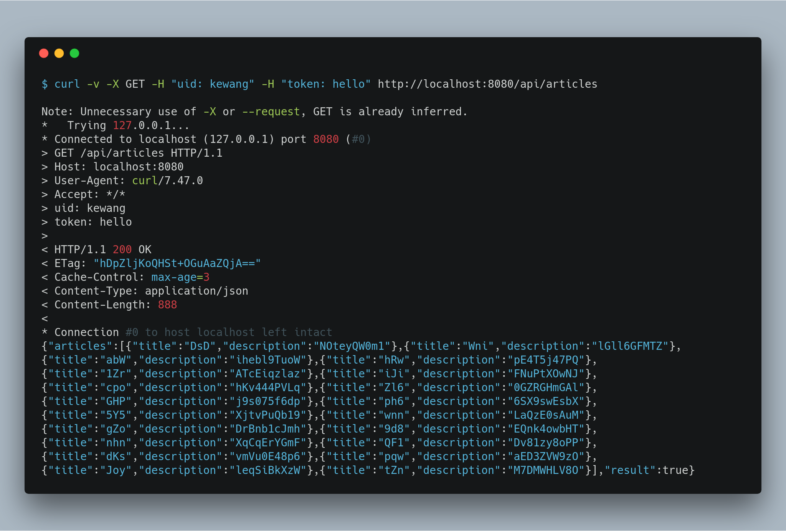
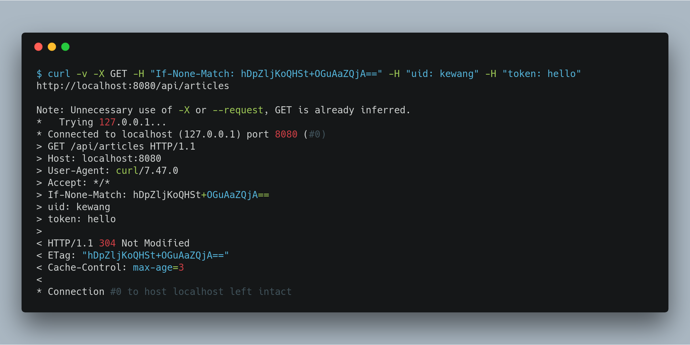
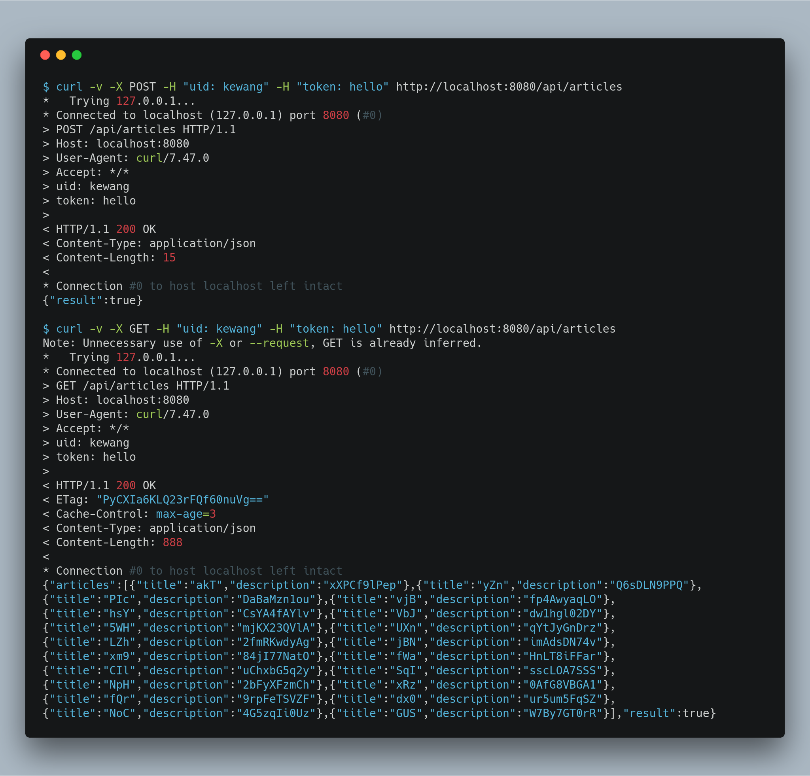
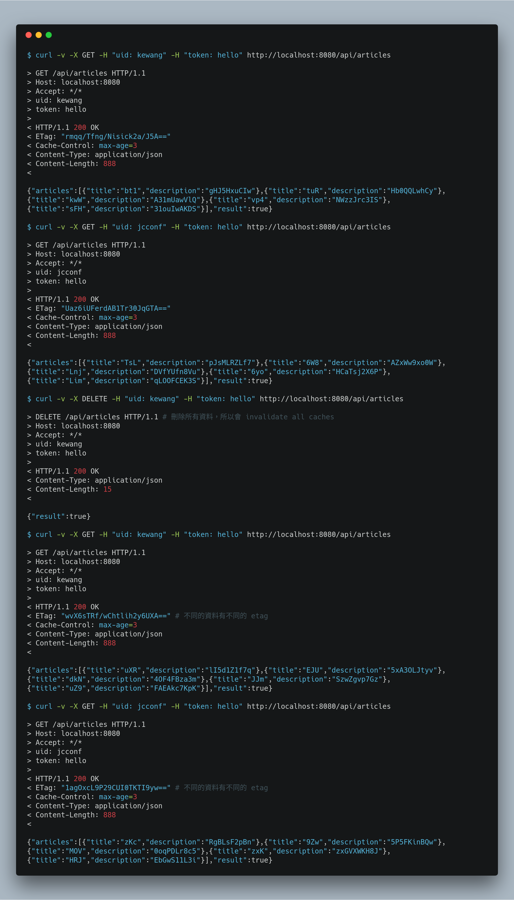

# cache-control-boilerplate

## Requirement

* Maven
* Docker

## ZooKeeper

### Run server

`./bin/zk-server.sh`

### Run client

`./bin/zk-client.sh`

## Web server

### Compile code

`./bin/web-compile.sh`

### Start up web node

`./bin/web-run.sh [PORT]`

## Test

### GET someone's articles from database

`curl -v -X GET -H "uid: kewang" -H "token: hello" http://localhost:8080/api/articles`

### GET someone's articles from cache via ETag

`curl -v -X GET -H "If-None-Match: hDpZljKoQHSt+OGuAaZQjA==" -H "uid: kewang" -H "token: hello" http://localhost:8080/api/articles`

### POST add someone's articles, so invalidate someone's cache

`curl -v -X POST -H "uid: kewang" -H "token: hello" http://localhost:8080/api/articles`

### DELETE remove everyone's articles, so invalidate everyone's caches

`curl -v -X DELETE -H "uid: kewang" -H "token: hello" http://localhost:8080/api/articles`

